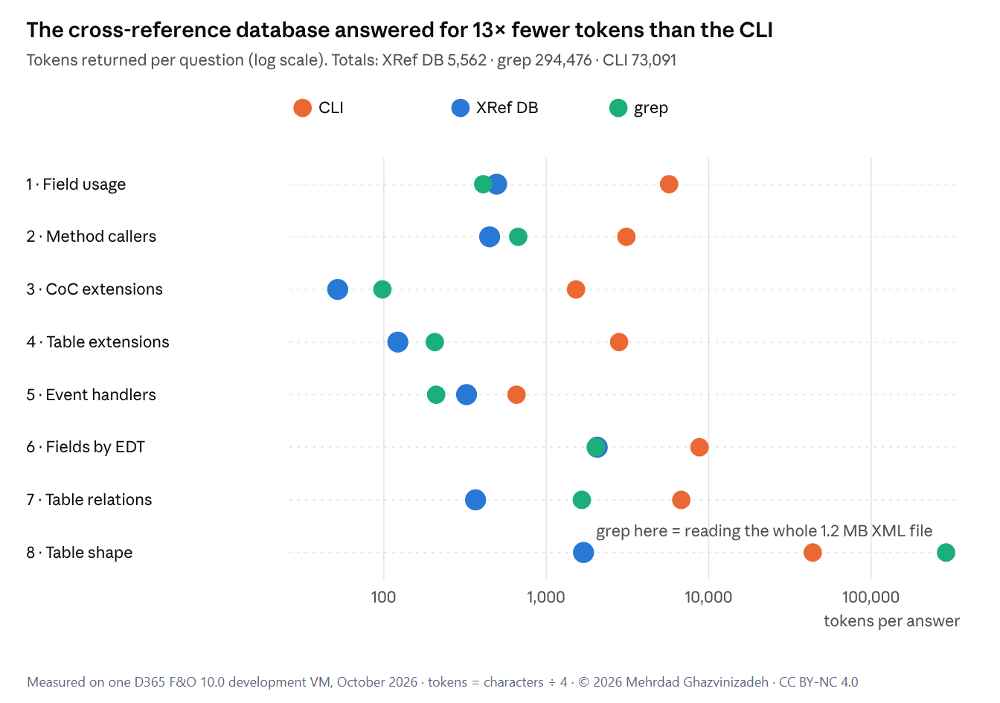

# D365FO Agent Lookups

© 2026 Mehrdad Ghazvinizadeh. All rights reserved, except as granted under
[CC BY-NC 4.0](https://creativecommons.org/licenses/by-nc/4.0/) (non-commercial use only). See [LICENSE.md](LICENSE.md).

Tooling and a repeatable procedure to make AI coding agents cheaper and more accurate when they look things up in a
Dynamics 365 Finance & Operations codebase. It compares three lookup methods and helps the agent pick the right one:

- the **d365fo CLI**, an X++ tool for AI agents with its own metadata index;
- the **cross-reference database** that Visual Studio builds, queried directly with SQL;
- **grep** on the AOT XML files.



In the first run, the cross-reference database answered eight typical questions for about **5,600 tokens**, grep
for about **5,300** and the CLI for about **73,000**. The CLI wins on extension, CoC and event-handler questions,
and it is the only one of the three that writes and checks code. Full numbers: [results/2026-10.md](results/2026-10.md).

## What's in this folder

| File | What it is |
|---|---|
| [`xref.ps1`](xref.ps1) | Named, names-only queries on the cross-reference database: `uses`, `coc`, `tableext`, `handlers`, `fields-by-edt`, `relations`, `fields`, `status` |
| [`bench.sh`](bench.sh) | The benchmark: 8 questions × 3 methods, records characters, tokens and time |
| [`CLAUDE.md.example`](CLAUDE.md.example) | A routing section for your agent's project instructions: which tool for which question, costs, traps |
| [`hooks/guard-large-aot-read.ps1`](hooks/guard-large-aot-read.ps1) | Hook that blocks reading a whole AOT XML file over 100 KB and suggests cheaper routes |
| [`hooks/index-sync.ps1`](hooks/index-sync.ps1) | Hook that runs `d365fo index sync` after every AOT edit, so the CLI index never goes stale |
| [`settings.example.json`](settings.example.json) | Example Claude Code settings that wire up the hooks, environment variables and a deny rule |
| [`results/`](results) | Benchmark results |

## Requirements

- A D365 F&O development VM with PackagesLocalDirectory
- The cross-reference database, filled by a Visual Studio build with **Update cross references** switched on
- `sqlcmd` and PowerShell 7 (`pwsh`)
- Git Bash, for `bench.sh`
- Optional: the d365fo CLI, for the CLI side of the benchmark and the index-sync hook

## Procedure

### 1. Make the cheap route easy

```powershell
$env:D365FO_XREF_SERVER = '(localdb)\MSSQLLocalDB'
$env:D365FO_XREF_DB     = '<your cross-reference database name>'

.\xref.ps1 uses SalesLine.SalesPrice -Module ApplicationSuite -Kind Classes
.\xref.ps1 uses SalesLine.calcLineAmount
.\xref.ps1 coc SalesLineType
.\xref.ps1 status
```

Find your database name in SQL Server Management Studio: it's the database with the tables `Names`,
`References` and `Modules`.

### 2. Tell the agent which tool to use

Copy the section in [`CLAUDE.md.example`](CLAUDE.md.example) into your project's instruction file and adjust the paths.
It gives the agent a routing table with costs, the freshness rules and the known traps.

### 3. Add the guardrails

Merge [`settings.example.json`](settings.example.json) into `.claude/settings.json` (or `settings.local.json`) and
replace the placeholders:

- **guard-large-aot-read** blocks the most expensive mistake: a whole read of a large AOT file (`SalesLine.xml` is
  about 289,000 tokens).
- **index-sync** keeps the CLI index current after each edit.
- The **deny rule** stops direct edits to models you don't own, so changes go through `d365fo modify`, which makes
  them into extensions.

### 4. Measure

```bash
export D365FO_CLI="/c/path/to/d365fo.exe"
export D365FO_PACKAGES="/c/path/to/PackagesLocalDirectory"
export D365FO_XREF_DB='<your cross-reference database name>'
./bench.sh          # all 8 questions
./bench.sh S3       # one question
```

Each run writes its raw outputs and a `summary.csv` to `results/run-<timestamp>/`. Rerun after a new CLI release, a
new model or a change to your instructions, and compare.

## The ten tips

1. A routing table with costs in the project instructions.
2. Make the cheap route as easy to call as the CLI (`xref.ps1`).
3. Say in skill descriptions when **not** to use a tool.
4. Make freshness checkable (`xref.ps1 status`, `d365fo index status`), or automatic (index-sync hook).
5. Block the expensive mistakes (guard hook).
6. Write the traps down once (model names, cross-reference path conventions).
7. Treat zero results as suspicious and cross-check with a second tool.
8. Say whether the session is lookup-only or development.
9. Enforce the write path with a deny rule.
10. Keep measuring.

## Status

This is a first measurement. Agents, models and tools improve quickly, so the numbers will change. A follow-up will
apply the tips above and measure again, including a full development task.

## Article

The background and the full analysis: *CLI vs XRef DB vs grep: token benchmarks for AI-assisted D365 F&O development*
(LinkedIn).
